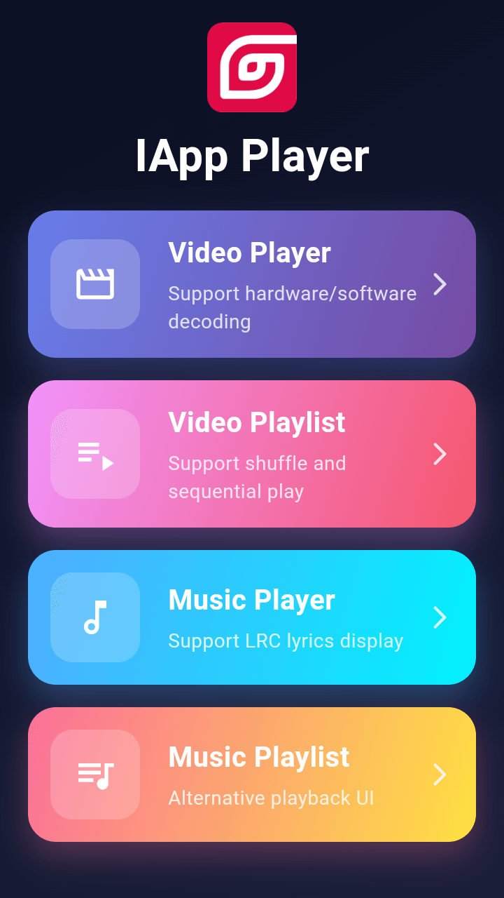
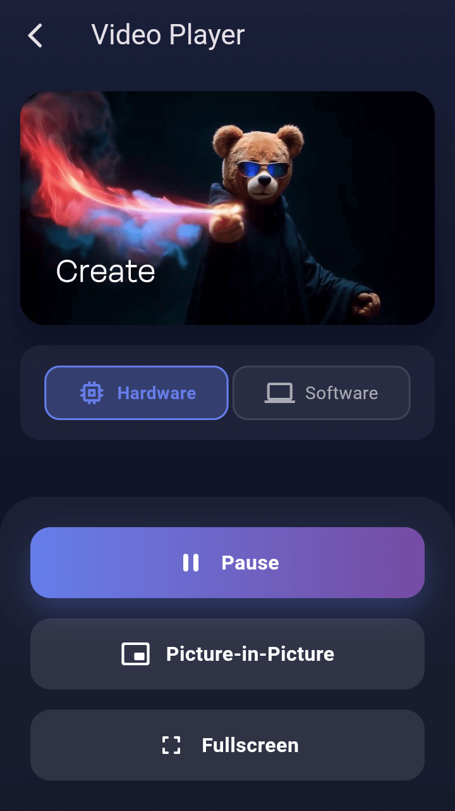
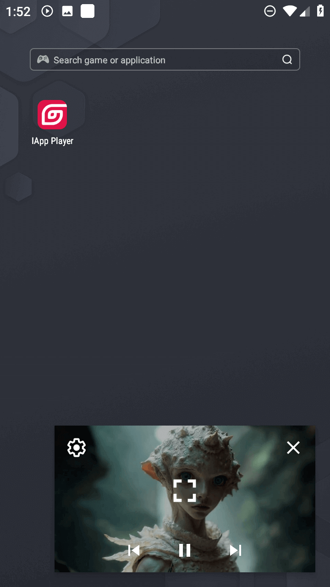
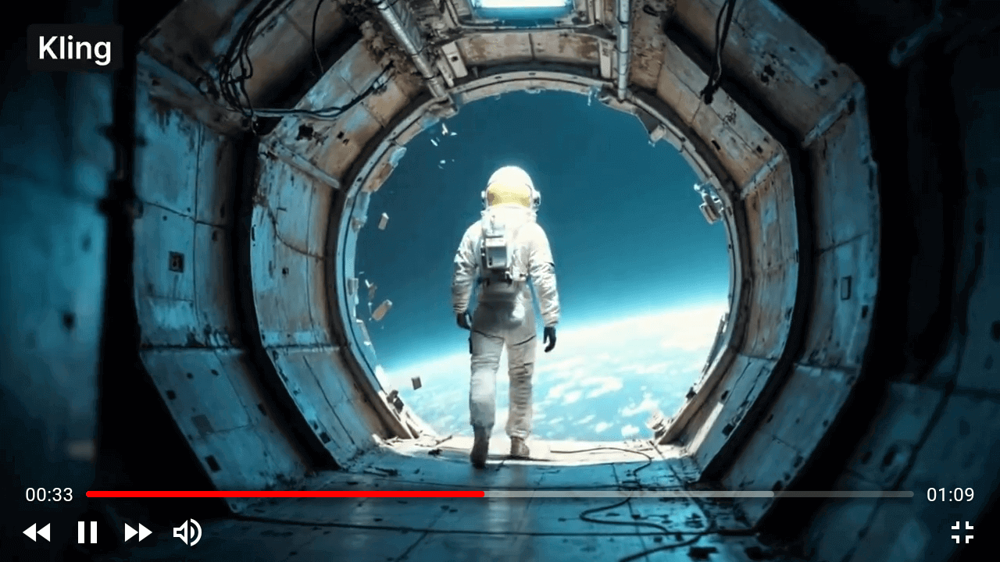
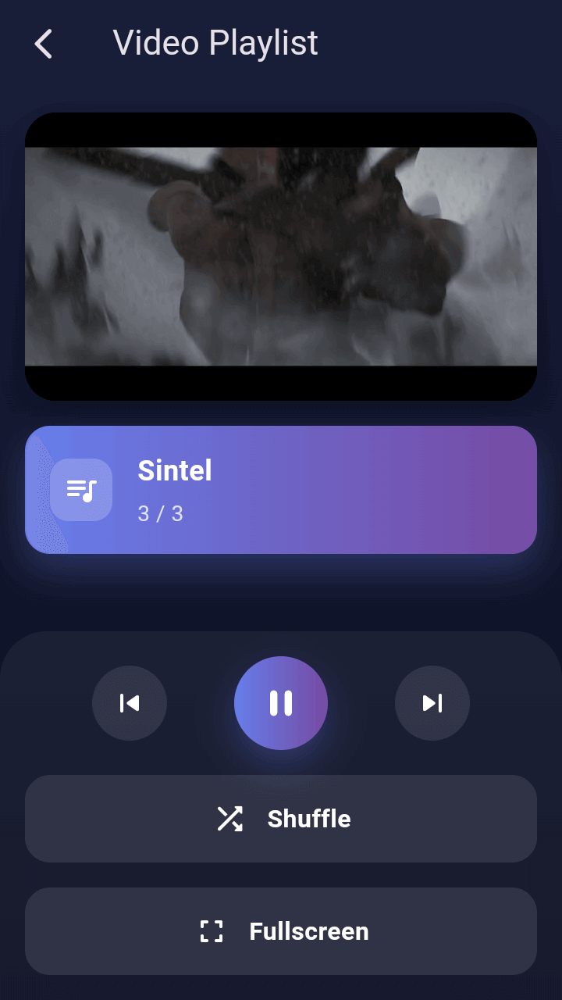
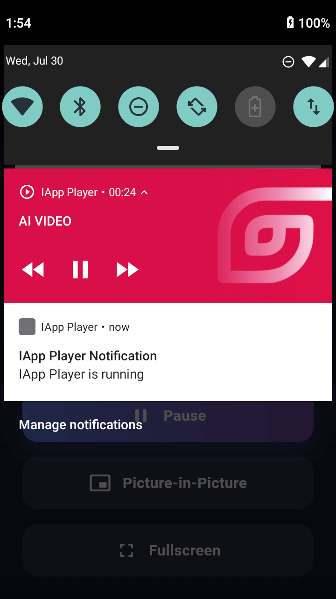
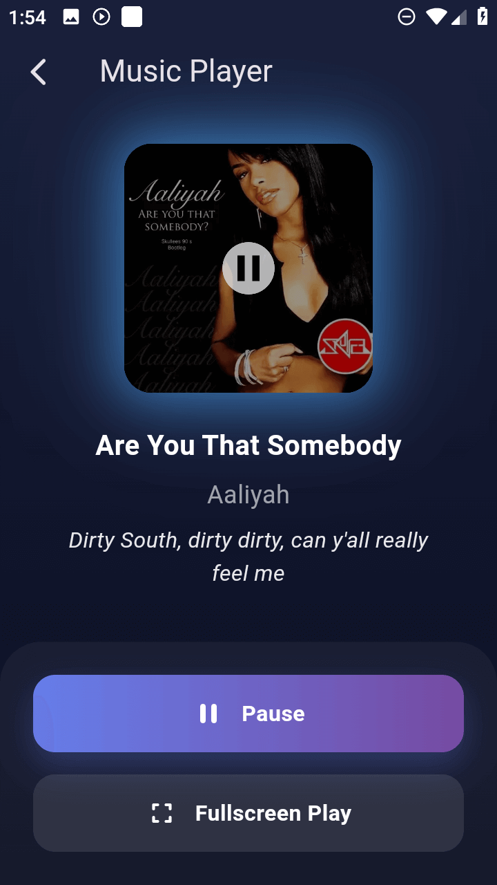
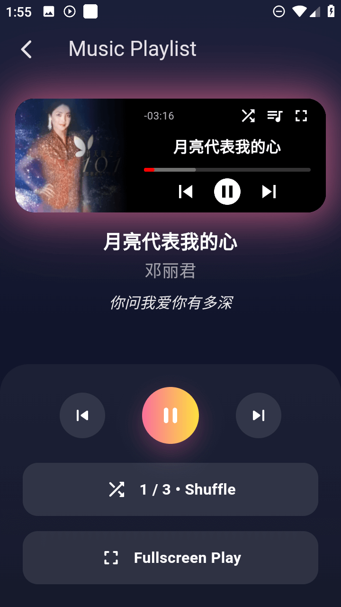
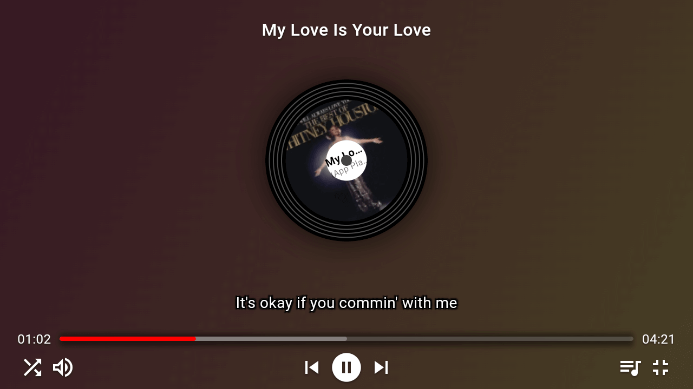

# IAppPlayer App Screenshots

> 🎬 Showcasing IAppPlayer's actual application effects in different scenarios

## 📺 Multi-Platform Support

### IAppPlayer Sample App
*IAppPlayer makes video playback simple yet powerful!*

  

## 📱 Playback Interface Showcase

### Video Playback Mode
*Supports Picture-in-Picture mode, software or hardware decoding switching*

  

### Picture-in-Picture Mode
*Display playback window on home screen or other apps*

  

### Fullscreen Playback Mode
*Supports multiple subtitle formats and various video control widgets*

  

### Playlist Playback Mode
*Supports shuffle or sequential playback settings*

  

### Notification Bar Playback Mode
*Control playback from notification bar, displays cover image*

  

## 🎵 Music Player Interface Showcase

### Cover Mode Interface
*Minimalist cover art music playback UI, supports synchronized lyrics*

  

### Compact Mode Interface
*Compact music playback UI, suitable for different scenarios*

  

### Large Screen Mode Interface
*Large screen music playback UI, supports LRC format lyrics, more operation controls*

  

## 🎯 Advanced Features Showcase

### Switch Songs in Playlist
*Supports playlist management, controls current playback progress switching*

  

---

**[⬅️ Back to Main Documentation](./README.md)**

**IAppPlayer - Making Video Playback Simple Yet Powerful!**

