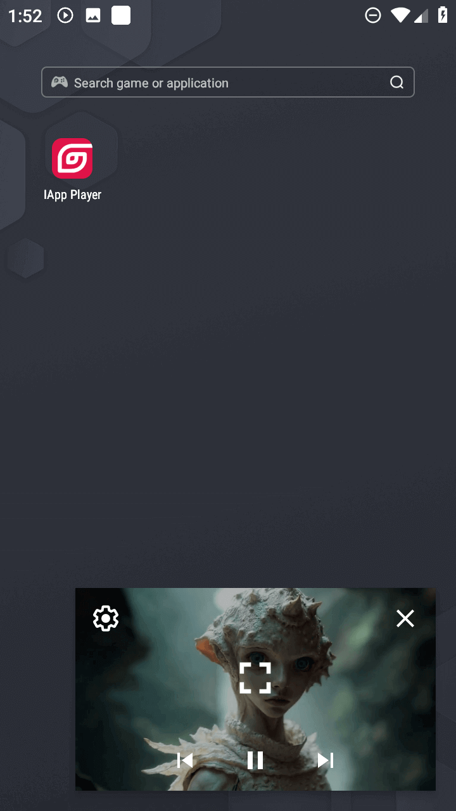
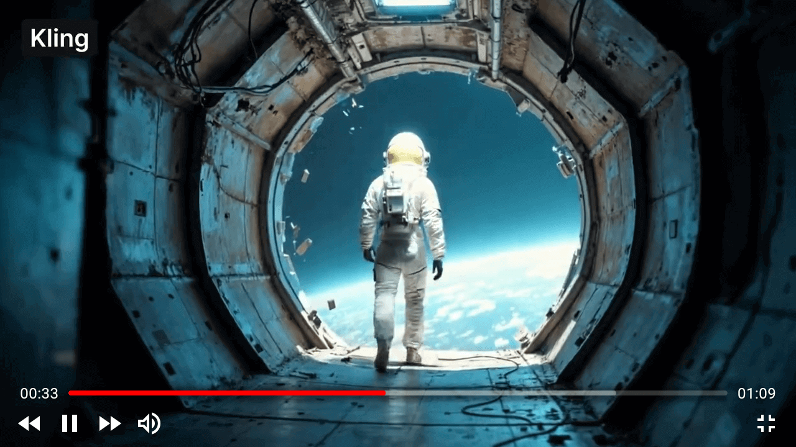
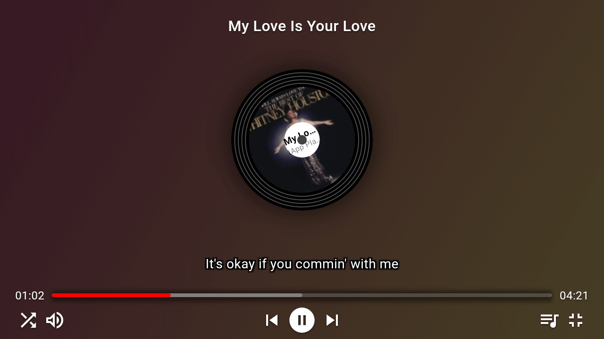

# IAppPlayer 应用截图展示

> 🎬 IAppPlayer 在不同场景下的实际应用效果展示

## 📺 多平台适配

### IAppPlayer 示例APP

*IAppPlayer 让视频播放变得简单而强大！*

## 📱 播放界面展示

### 视频播放模式

*支持画中画模式、软件或硬件解码切换*

### 画中画播放模式

*在主屏幕或其它APP显示播放窗口*

### 全屏播放模式

*支持多种字幕、和各种视频操作控件*

### 播放列表播放模式

*支持设置随机切换或按顺序播放*

### 通知栏播放模式

*在通知栏控制播放，显示封面图片*

## 🎵 音乐播放界面展示

### 封面模式界面

*简约的封面图音乐播放UI，支持调用歌词同步*

### 紧凑模式界面

*紧凑音乐播放UI，适用于不同场景下的需要*

### 大屏模式界面

*大屏音乐播放UI，支持LRC格式歌词，更多的操作控制*

## 🎯 部分高级功能展示

### 在播放列表切换歌曲

*支持播放列表管理，控制当前播放进度的切换*

---

**[⬅️ 返回主文档](./README_CN.md)**

